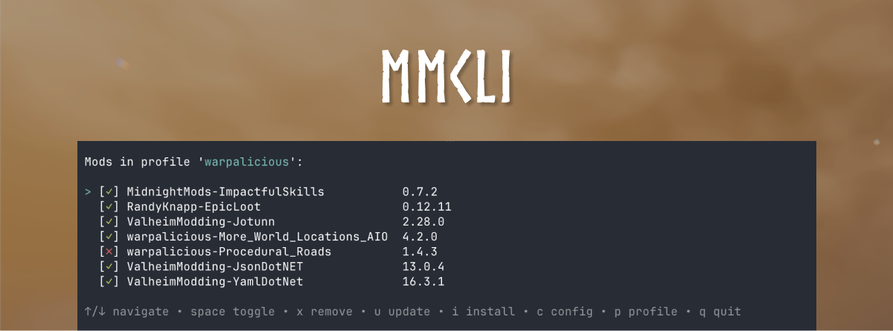

<p align="center">
  
</p>

# mmcli

A command-line Valheim mod manager for macOS. Installs mods from [Thunderstore](https://thunderstore.io/c/valheim/), manages profiles, and launches the game with BepInEx.

## Install

### Homebrew (recommended)

```
brew install jneb802/tap/mmcli
```

### Shell script

```
curl -fsSL https://raw.githubusercontent.com/jneb802/mmcli/main/install.sh | bash
```

### Manual download

Download the latest binary from [Releases](https://github.com/jneb802/mmcli/releases), then:

```
chmod +x mmcli-darwin-*
mv mmcli-darwin-* /usr/local/bin/mmcli
```

## Getting Started

```
mmcli init
```

This detects your Valheim install, installs BepInEx, and creates a default profile.

## Interactive TUI

```
mmcli tui
```

A terminal UI for browsing, toggling, installing, updating, and removing mods with keyboard shortcuts.

## Launching the Game

```
mmcli start
```

Launches Valheim with BepInEx loaded and streams logs to the terminal.

## Installing Mods

```
mmcli install RandyKnapp-EpicLoot
```

Dependencies are resolved and installed automatically.

## Managing Mods

```
mmcli list                        # show installed mods
mmcli remove <mod>                # remove a mod and orphaned dependencies
```

## Profiles

Profiles let you maintain separate sets of mods (e.g. one for solo, one for a modded server).

```
mmcli profile create <name>
mmcli profile switch <name>
mmcli profile list
mmcli profile delete <name>
mmcli profile import <url|code>   # import from r2modman/Thunderstore profile code
mmcli profile open                # open profile folder in Finder
```
